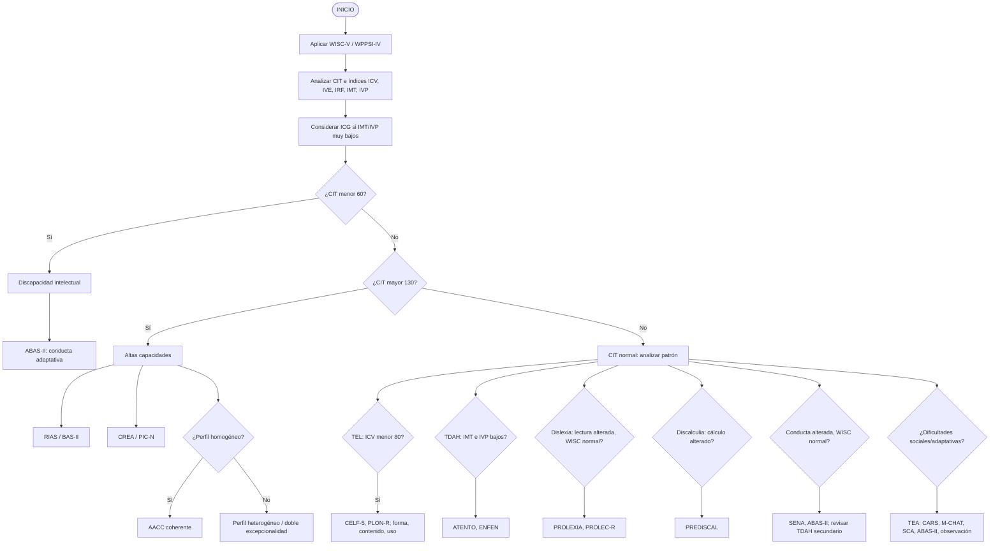

# Flujo de evaluación: WISC-V / WPPSI-IV y pruebas complementarias

Documento de **referencia orientativa** para alinear la app y la práctica clínica. No sustituye manuales oficiales (Pearson, TEA, etc.) ni criterios diagnósticos DSM/ICD. Las decisiones finales corresponden al profesional.

---

## Diagrama de flujo (texto)

```
INICIO
│
├── Aplicar WISC-V / WPPSI-IV
│      ├── Analizar CIT
│      ├── Analizar índices: ICV, IVE, IRF, IMT, IVP
│      └── Considerar ICG si IMT/IVP ↓↓↓
│
├── ¿CIT < 60?
│      └── SÍ → DISCAPACIDAD INTELECTUAL
│             └── Evaluar conducta adaptativa (ABAS-II)
│
├── ¿CIT > 130?
│      └── SÍ → ALTAS CAPACIDADES
│             ├── Confirmar: RIAS / BAS-II
│             ├── Creatividad: CREA / PIC-N
│             └── ¿Perfil homogéneo?
│                    ├── SÍ → AACC
│                    └── NO → Perfil heterogéneo / doble excepcionalidad
│
└── CIT NORMAL → ANALIZAR PATRÓN
       │
       ├── ¿ICV ↓ (<80)?
       │      └── TEL
       │            ├── CELF-5
       │            ├── PLON-R
       │            └── Evaluar: forma, contenido, uso
       │
       ├── ¿IMT ↓ + IVP ↓?
       │      └── TDAH
       │            ├── ATENTO
       │            ├── ENFEN
       │            └── Inatención / impulsividad / hiperactividad
       │
       ├── ¿Lectura alterada con WISC normal?
       │      └── DISLEXIA
       │            ├── PROLEXIA
       │            └── PROLEC-R
       │
       ├── ¿Cálculo alterado con WISC casi normal?
       │      └── DISCALCULIA
       │            └── PREDISCAL
       │
       ├── ¿Conducta alterada con WISC normal?
       │      └── TRASTORNO DE CONDUCTA
       │            ├── SENA
       │            ├── ABAS-II
       │            └── Revisar si es secundario a TDAH
       │
       └── ¿Dificultades sociales/adaptativas?
              └── TEA
                   ├── CARS
                   ├── M-CHAT
                   ├── SCA
                   ├── ABAS-II
                   └── Observación familia + profesorado
```

---

## Diagrama equivalente (Mermaid)

Vista útil en editores y plataformas que rendericen Mermaid (p. ej. GitHub, VS Code con extensión).



---

## Matriz trastorno / indicadores WISC / tests complementarios

| **Trastorno / Perfil** | **Indicadores en WISC** | **Test complementarios** | **Criterios de decisión** |
| ---------------------- | ----------------------- | ------------------------ | ------------------------- |
| **Discapacidad Intelectual (DI)** | CIT < 60 | ABAS-II | Bajo rendimiento cognitivo + afectación adaptativa |
| **Altas Capacidades (AACC)** | CIT > 130, ICV / IRF altos | RIAS, BAS-II, CREA, PIC-N | Alto CI + coherencia interna + (opcional) creatividad |
| **Perfil AACC heterogéneo** | CI alto pero índices desiguales | RIAS, BAS-II | Diferencias internas marcadas → valorar doble excepcionalidad |
| **TEL (Lenguaje)** | ICV < 80, discrepancia con otros índices | CELF-5, PLON-R | Alteración en expresión, comprensión o pragmática |
| **TDAH** | IMT ↓ + IVP ↓ (respecto a ICV, IVE, IRF) | ATENTO, ENFEN | Problemas de atención + impulsividad + ejecución |
| **Dislexia** | WISC normal (80–110 aprox.) | PROLEXIA, PROLEC-R | Déficit en procesos lectores (precisión, velocidad, comprensión) |
| **Discalculia** | IMT ↓ (frecuente), IRF ↓ (a veces) | PREDISCAL | Dificultad específica en número y cálculo |
| **Trastorno de conducta** | WISC normal | SENA, ABAS-II, ATENTO | Índices conductuales elevados (>60) |
| **Conducta secundaria a TDAH** | IMT/IVP ↓ + conducta alterada | ATENTO, ENFEN | Conducta explicada por déficit atencional |
| **TEA** | Variable (no determinante) | CARS, M-CHAT, SCA, ABAS-II | Dificultades en comunicación social + rigidez + adaptación |
| **Dificultad secundaria (no específica)** | Perfil mixto o inconsistente | Todos según sospecha | Explicado por contexto, emocional, instrucción o combinación |

---

## 🧠✨ Infografía: sistema de detección psicopedagógica

*Modelo de decisión basado en WISC y pruebas específicas*

### 🔷 1. Punto de partida

📊 **Evaluación cognitiva base**

**WISC-V / WPPSI-IV**

👉 **Analizamos:**

- **CIT** (CI total)
- **Índices:**
  - 🗣 ICV (verbal)
  - 🧩 IVE (visoespacial)
  - 🔍 IRF (razonamiento)
  - 🧠 IMT (memoria)
  - ⚡ IVP (velocidad)

💡 Si IMT e IVP están muy bajos → usar **ICG** (según manual).

---

### 🔷 2. Primer filtro (decisión global)

🔴 **CI < 60**

- ➡️ Discapacidad intelectual
  - ✔ Confirmar con **ABAS-II**
  - ✔ Evaluar autonomía y adaptación

🟢 **CI > 130**

- ➡️ Altas capacidades (**AACC**)
  - ✔ **RIAS** / **BAS-II**
  - ✔ **CREA** / **PIC-N**

🔎 **Clave:**

- Perfil homogéneo → AACC
- Perfil desigual → posible doble excepcionalidad

🟡 **CI normal**

- ➡️ Analizar patrón de índices (apartado 3)

---

### 🔷 3. Análisis por patrones (núcleo del sistema)

#### 🗣 Lenguaje → TEL

📉 **ICV bajo (<80)**

- ✔ **CELF-5**
- ✔ **PLON-R**

🔍 **Evaluar:** expresión, comprensión, pragmática

➡️ Trastorno del lenguaje

---

#### ⚡ Atención → TDAH

📉 **IMT ↓ + IVP ↓** (respecto a ICV, IVE, IRF)

- ✔ **ATENTO**
- ✔ **ENFEN**

🔍 **Indicadores:** inatención, impulsividad, hiperactividad

➡️ TDAH

---

#### 📖 Lectura → dislexia

📊 WISC normal · 📉 lectura alterada

- ✔ **PROLEC-R**
- ✔ **PROLEXIA**

🔍 **Déficits en:** precisión, velocidad, comprensión

➡️ Dislexia

---

#### 🔢 Cálculo → discalculia

📊 WISC casi normal · 📉 **IMT ↓** (frecuente)

- ✔ **PREDISCAL**

🔍 **Problemas en:** número, cálculo, razonamiento matemático

➡️ Discalculia

---

#### 🔥 Conducta → trastorno conductual

📊 WISC normal

- ✔ **SENA**
- ✔ **ABAS-II**

🔍 **Índices > 60** (conducta / emoción)

⚠️ **Revisar antes:** ¿es **TDAH**?

➡️ Trastorno de conducta / perfil externalizante

---

#### 🧩 Social → TEA

📊 WISC no determinante

- ✔ **CARS**
- ✔ **M-CHAT**
- ✔ **SCA**
- ✔ **ABAS-II**

🔍 **Claves:** comunicación social, rigidez, adaptación

➡️ TEA

---

### 🔷 4. Regla de oro del sistema

🚫 **No** diagnosticar con una sola prueba

✔ **Siempre** cruzar:

- 🧠 Cognitivo → WISC
- 📊 Específico → test del área
- 👀 Observación → aula
- 👨‍👩‍👧 Familia
- 🧩 Conducta → SENA / ATENTO
- 🏠 Adaptativo → ABAS

---

## Notas para la implementación en `orientacion`

- Los **umbrales heurísticos** en código (CIT, ICV, IMT/IVP, AACC homogéneo, etc.) son **orientativos** y deben contrastarse con tablas por edad y con este documento solo como guía de mesa.
- **SENA**, **ABAS-II**, **cribados TEA**, etc. tienen modelos o roadmap en `js/instrumentos-roadmap.js` y módulos dedicados cuando apliquen.
- **WPPSI-IV** en población infantil es el análogo de batería cognitiva inicial; el flujo lógico es paralelo al del WISC-V en edad escolar.
